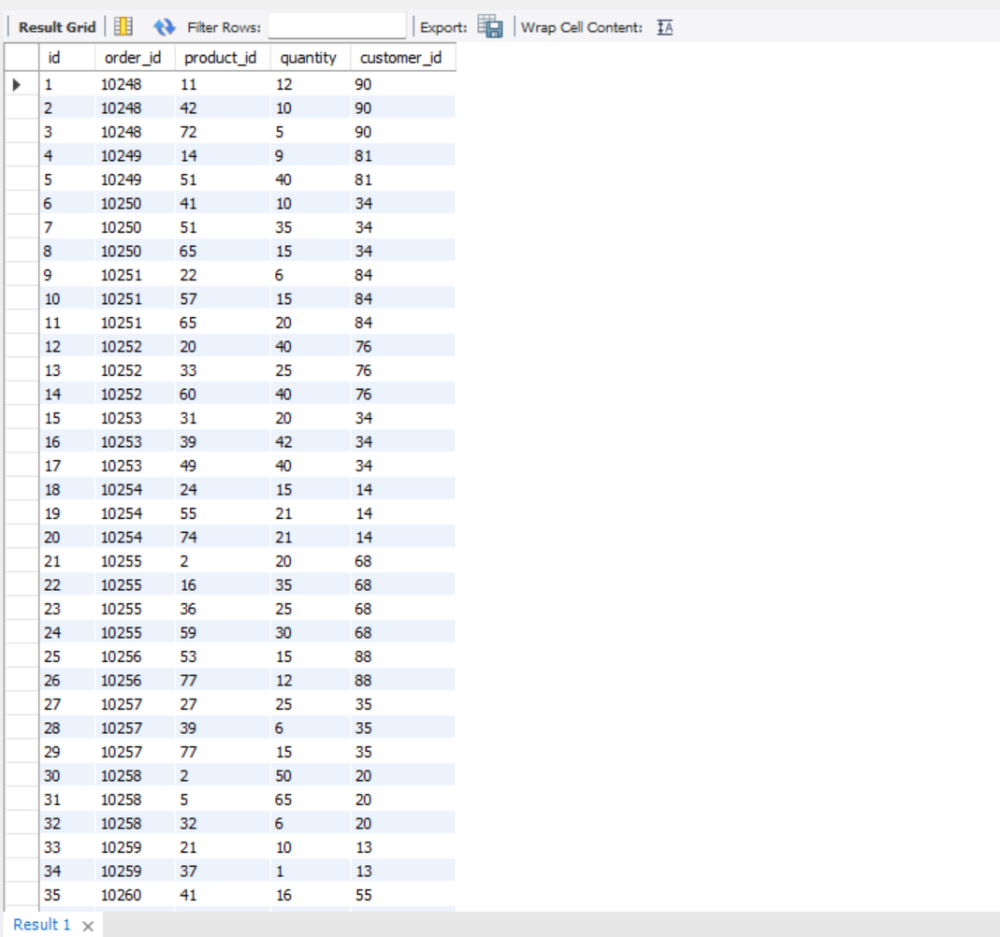
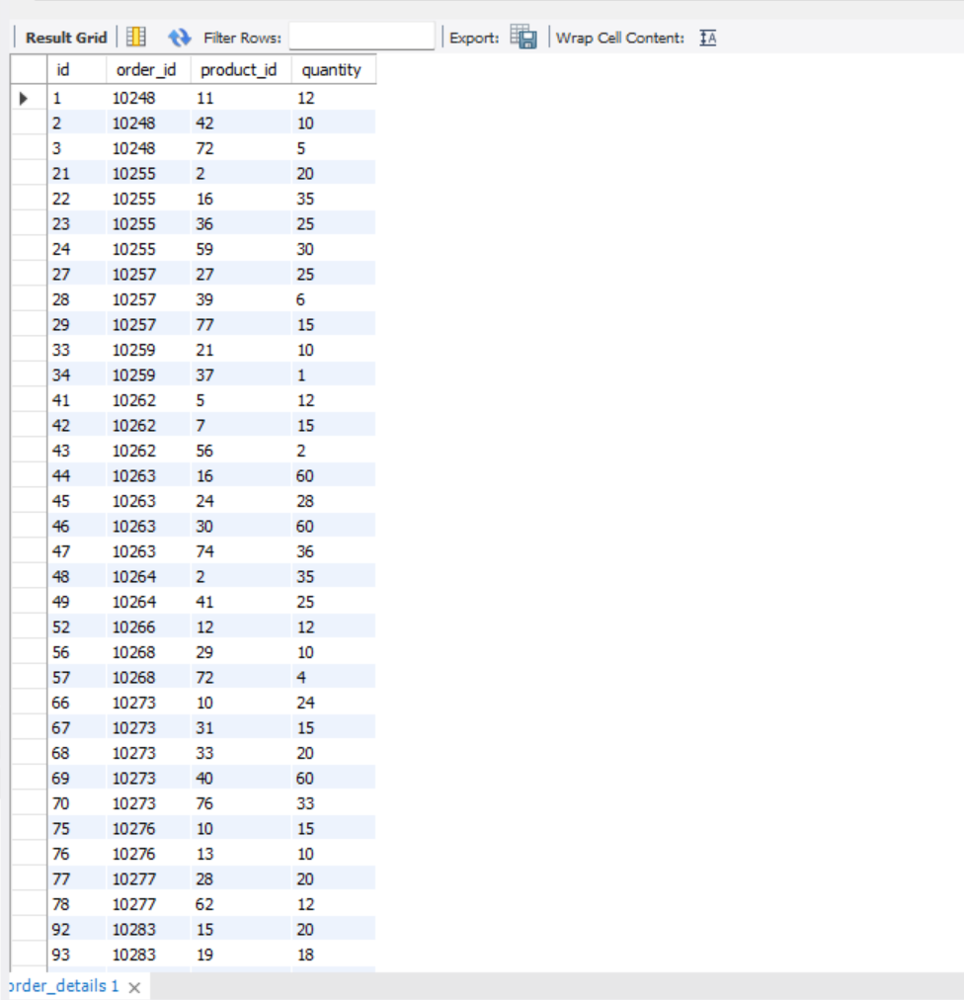
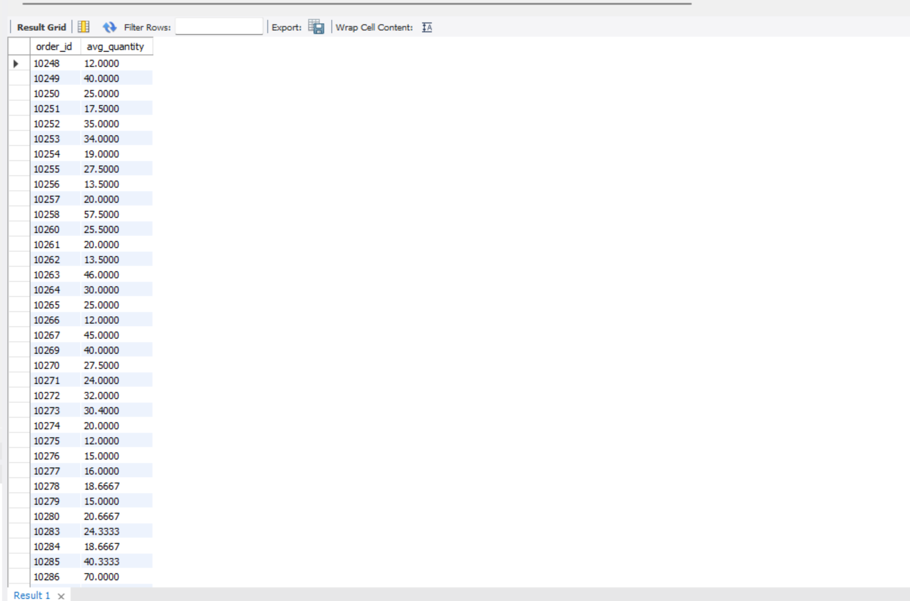
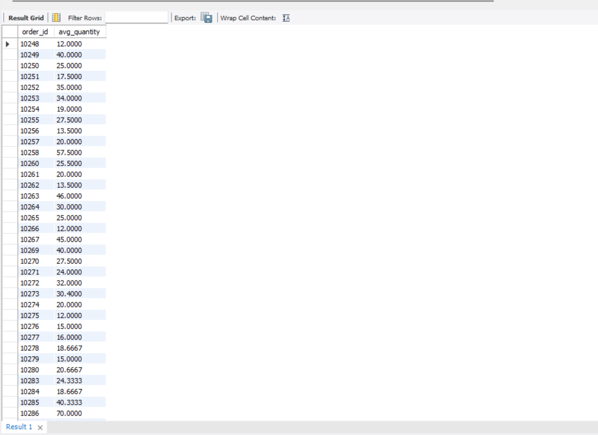
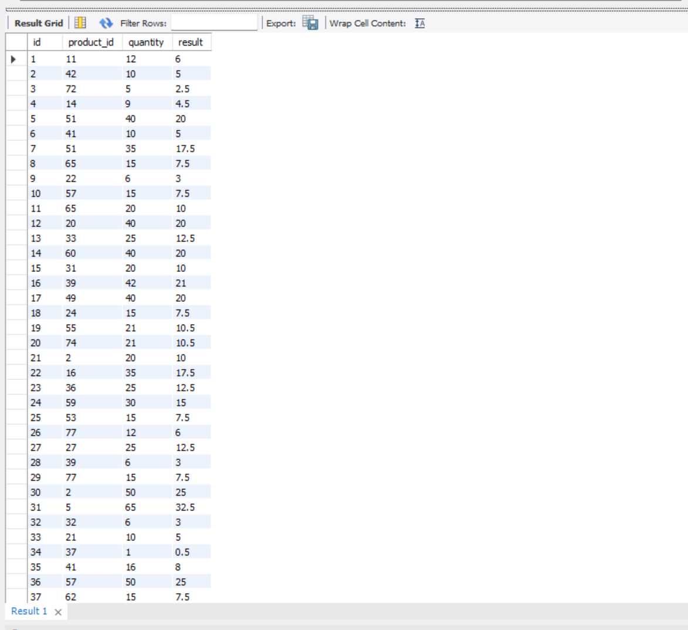

# woolf-rdb-hw-05

# Домашнє завдання №5 — Вкладені запити. Повторне використання коду

## 📚 Опис

У цьому завданні реалізовано вкладені SQL-запити у `SELECT`, `WHERE`, `FROM`, використано `WITH` для тимчасової таблиці та створено функцію з параметрами. Дані взято з бази `woolf-rdb-hw-03`.

---

## 📁 Структура проєкту

```text
├── 01_subquery_in_select.sql
├── 02_subquery_in_where.sql
├── 03_subquery_in_from.sql
├── 04_with_temp_table.sql
├── 05_function_divide_float.sql
├── screenshots/
│ ├── p1_subquery_in_select_customer_id.png
│ ├── p2_subquery_in_where_shipper_id_3.png
│ ├── p3_subquery_in_from_quantity_gt_10.png
│ ├── p4_with_temp_table_quantity_gt_10.png
│ ├── p5_create_function_divide_float.png
│ └── p5_apply_function_on_quantity.png

```


---

## ✅ Завдання

### 🔹 1. Вкладений запит у `SELECT`

- 📄 SQL-файл: [`01_subquery_in_select.sql`](./01_subquery_in_select.sql)
- 🖼️ Скріншот:  
  

---

### 🔹 2. Вкладений запит у `WHERE`

- 📄 SQL-файл: [`02_subquery_in_where.sql`](./02_subquery_in_where.sql)
- 🖼️ Скріншот:  
  

---

### 🔹 3. Вкладений запит у `FROM` з `GROUP BY`

- 📄 SQL-файл: [`03_subquery_in_from.sql`](./03_subquery_in_from.sql)
- 🖼️ Скріншот:  
  

---

### 🔹 4. Те саме, але з `WITH temp`

- 📄 SQL-файл: [`04_with_temp_table.sql`](./04_with_temp_table.sql)
- 🖼️ Скріншот:  
  

---

### 🔹 5. Функція `divide_float(x, y)` + використання

- 📄 SQL-файл: [`05_function_divide_float.sql`](./05_function_divide_float.sql)
- 🖼️ Скріншот:
  - 

---

## 📝 Коментар

Усі запити протестовані в базі `woolf-rdb-hw-03`, результати задокументовані скріншотами, кожен крок відповідає завданню теми 5.

---
